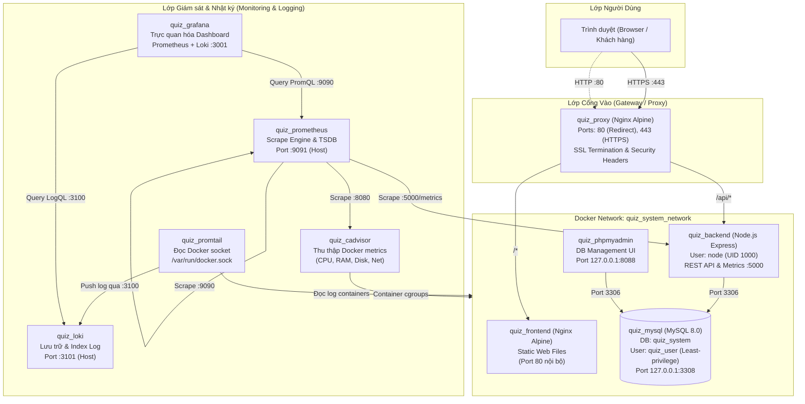

# HỆ THỐNG THI TRẮC NGHIỆM TRỰC TUYẾN (QUIZ SYSTEM)

> **Báo cáo đồ án / Bài tập lớn môn học:** Xây dựng, đóng gói và vận hành Hệ thống Thi trắc nghiệm trực tuyến trên nền tảng Docker kết hợp Giám sát hạ tầng (Monitoring), Nhật ký tập trung (Centralized Logging) và Tăng cường bảo mật (Security Hardening).

---

## MỤC LỤC
1. [Giới thiệu dự án](#1-giới-thiệu-dự-án)
2. [Kiến trúc hệ thống](#2-kiến-trúc-hệ-thống)
3. [Yêu cầu môi trường](#3-yêu-cầu-môi-trường)
4. [Hướng dẫn cài đặt và chạy](#4-hướng-dẫn-cài-đặt-và-chạy)
5. [Bảng địa chỉ truy cập các dịch vụ](#5-bảng-địa-chỉ-truy-cập-các-dịch-vụ)
6. [Chức năng và kịch bản kiểm thử](#6-chức-năng-và-kịch-bản-kiểm-thử)
7. [Nginx Reverse Proxy & Cấu hình HTTPS](#7-nginx-reverse-proxy--cấu-hình-https)
8. [Hệ thống Giám sát với Prometheus & Grafana](#8-hệ-thống-giám-sát-với-prometheus--grafana)
9. [Hệ thống Nhật ký tập trung với Loki & Promtail](#9-hệ-thống-nhật-ký-tập-trung-với-loki--promtail)
10. [Tăng cường Bảo mật (Security Hardening)](#10-tăng-cường-bảo-mật-security-hardening)
11. [Cấu trúc thư mục dự án](#11-cấu-trúc-thư-mục-dự-án)
12. [Khắc phục lỗi thường gặp (Troubleshooting)](#12-khắc-phục-lỗi-thường-gặp-troubleshooting)
13. [Lịch sử triển khai & Các mốc Commit](#13-lịch-sử-triển-khai--các-mốc-commit)
14. [Lưu ý quan trọng khi nộp bài](#14-lưu-ý-quan-trọng-khi-nộp-bài)

---

## 1. Giới thiệu dự án

### 1.1. Mục tiêu
**Hệ thống Quiz / Thi trắc nghiệm trực tuyến** được xây dựng nhằm phục vụ nhu cầu tổ chức thi và kiểm tra trắc nghiệm cho học sinh/sinh viên. Ứng dụng cung cấp giao diện trực quan, linh hoạt với nhiều dạng câu hỏi, tính năng chấm điểm tự động và thống kê kết quả thi theo thời gian thực. Toàn bộ hệ thống được container hóa hoàn chỉnh bằng Docker Compose, triển khai Reverse Proxy HTTPS an toàn, tích hợp đầy đủ công cụ giám sát hiệu năng và lưu trữ nhật ký tập trung.

### 1.2. Các chức năng chính
- **Xác thực & Phân quyền:**
  - Đăng nhập, đăng ký tài khoản với JWT (JSON Web Token), mã hóa mật khẩu an toàn bằng `bcryptjs`.
  - Phân quyền 2 vai trò rõ ràng: `ADMIN` (Quản trị viên) và `USER` (Học sinh/Sinh viên).
- **Phía Sinh viên (USER):**
  - Xem danh sách các đề thi hiện có, thời gian làm bài, số lượng câu hỏi.
  - Làm bài thi trắc nghiệm với đồng hồ đếm ngược (Timer).
  - Hỗ trợ đa dạng **5 dạng câu hỏi**:
    1. *Trắc nghiệm một đáp án (Single Choice - ABCD)*
    2. *Chọn nhiều đáp án đúng (Multiple Choice)*
    3. *Đúng / Sai (True / False)*
    4. *Điền vào chỗ trống (Fill in the Blank)*
    5. *Phân loại theo nhóm (Classification)*
  - Nộp bài thi, hệ thống chấm điểm tự động tức thì trên thang điểm 10.
  - Xem lại chi tiết lịch sử bài làm, đáp án đã chọn và đáp án đúng.
- **Phía Quản trị viên (ADMIN):**
  - Dashboard thống kê tổng quan: Tổng số sinh viên, tổng số đề thi, câu hỏi, lượt thi và điểm trung bình.
  - Quản lý đề thi (Thêm, Sửa, Xóa đề thi, chỉnh thời lượng).
  - Quản lý câu hỏi & đáp án (Thêm, Sửa, Xóa câu hỏi cho từng đề).
  - Quản lý danh sách tài khoản học sinh (Thêm mới, Reset mật khẩu, Xóa tài khoản).
  - Theo dõi kết quả thi của toàn bộ sinh viên trong hệ thống.

### 1.3. Công nghệ sử dụng
- **Frontend:** HTML5, CSS3 hiện đại, Vanilla JavaScript (Single Page Application logic).
- **Backend:** Node.js (v20 Alpine), Express.js framework, kiến trúc RESTful API.
- **Database:** MySQL 8.0 lưu trữ cơ sở dữ liệu quan hệ (`quiz_system`).
- **Database Management:** phpMyAdmin hỗ trợ quản trị CSDL qua giao diện web.
- **Web Server & Reverse Proxy:** Nginx Alpine (SSL/TLS Termination, Security Headers, Gzip, HTTP-to-HTTPS redirect).
- **Metrics Monitoring:** Prometheus (Scrape metrics) + Grafana (Dashboard) + cAdvisor (Container Resource metrics) + `prom-client` (Node.js runtime metrics).
- **Centralized Logging:** Loki (Log database) + Promtail (Docker log shipper) + Grafana Explore (LogQL query).
- **Orchestration:** Docker Compose quản lý 10 services độc lập trong cùng bridge network.

---

## 2. Kiến trúc hệ thống

### 2.1. Sơ đồ kiến trúc tổng thể (Architecture Diagram)



### 2.2. Vai trò của từng thành phần
1. **quiz_proxy (Nginx Reverse Proxy):** Tiếp nhận toàn bộ lưu lượng web bên ngoài tại port 80 và 443. Thực hiện chuyển hướng (301 redirect) HTTP sang HTTPS, giải mã SSL/TLS (SSL Termination), chèn các HTTP Security Headers bảo vệ và định tuyến:
   - `/api/` chuyển tiếp vào `quiz_backend:5000`.
   - Các đường dẫn còn lại chuyển tiếp vào `quiz_frontend:80`.
2. **quiz_frontend:** Image Nginx Alpine siêu nhẹ phục vụ toàn bộ file tĩnh (HTML, CSS, JS) cho người dùng. Không mở port trực tiếp ra máy host.
3. **quiz_backend:** Ứng dụng Node.js Express xử lý logic đăng ký, đăng nhập JWT, tính điểm trắc nghiệm, truy vấn cơ sở dữ liệu và phơi bày endpoint `/metrics` cho Prometheus. Chạy dưới quyền non-root `node` (UID 1000).
4. **quiz_mysql:** Cơ sở dữ liệu MySQL 8.0 lưu trữ người dùng, đề thi, câu hỏi, đáp án và kết quả làm bài. Dữ liệu được lưu bền vững qua Docker volume `quiz_mysql_data`.
5. **quiz_phpmyadmin:** Công cụ đồ họa quản trị CSDL MySQL, hỗ trợ kiểm tra dữ liệu và bảo trì nhanh chóng. Chỉ bind vào `127.0.0.1` để ngăn truy cập trái phép từ bên ngoài mạng.
6. **quiz_prometheus:** Máy chủ giám sát chuỗi thời gian (TSDB). Định kỳ mỗi 10 giây thu thập metrics từ `quiz_backend` (/metrics), `quiz_cadvisor` và chính nó.
7. **quiz_cadvisor:** Thu thập các chỉ số phần cứng của container trực tiếp từ Docker daemon và Linux cgroups (CPU, RAM, Network I/O, Disk usage).
8. **quiz_grafana:** Nền tảng hiển thị đồ họa trực quan hóa. Tích hợp sẵn Dashboard giám sát trạng thái 10 containers, CPU/RAM, lưu lượng request HTTP và log thời gian thực.
9. **quiz_loki:** Hệ thống lưu trữ và truy vấn log tập trung tối ưu hóa chi phí, đánh chỉ mục theo labels thay vì toàn bộ nội dung text.
10. **quiz_promtail:** Agent thu thập log chạy nền, kết nối trực tiếp vào `/var/run/docker.sock`, tự động gán nhãn container và đẩy log về Loki theo thời gian thực.

---

## 3. Yêu cầu môi trường

Để cài đặt và vận hành hệ thống, máy trạm cần đáp ứng:
- **Hệ điều hành:** Windows 10/11 (chạy Docker Desktop với WSL 2 backend), Linux (Ubuntu 20.04/22.04 LTS), hoặc macOS.
- **Docker Engine:** Phiên bản `>= 24.0.0`.
- **Docker Compose:** Phiên bản `>= v2.20.0` (tích hợp sẵn trong lệnh `docker compose`).
- **Phần cứng khuyến nghị:**
  - RAM: Tối thiểu 4 GB (Khuyến nghị 8 GB trở lên để 10 container hoạt động mượt mà).
  - Dung lượng ổ đĩa trống: Tối thiểu 5 GB.
- **Trình duyệt Web:** Chrome, Edge, Firefox hoặc Safari phiên bản mới.
- **Công cụ kiểm tra (Tùy chọn):** `curl` / PowerShell / Postman.

---

## 4. Hướng dẫn cài đặt và chạy

### Bước 1: Clone Repository
Mở Terminal hoặc PowerShell trên máy host:
```bash
git clone https://github.com/vlong3217-png/quiz-trac-nghiem.git
cd quiz-trac-nghiem
```

### Bước 2: Thiết lập biến môi trường `.env`
Hệ thống sử dụng file `.env` để bảo vệ các thông tin cấu hình nhạy cảm. Copy từ file mẫu `.env.example`:

- **Trên Windows (PowerShell):**
  ```powershell
  Copy-Item .env.example .env
  ```
- **Trên Linux / macOS / Git Bash:**
  ```bash
  cp .env.example .env
  ```

> ⚠️ **LƯU Ý BẢO MẬT QUAN TRỌNG:**
> Mở file `.env` vừa tạo và chỉnh sửa các giá trị mặc định thành mật khẩu mạnh riêng của bạn:
> - `DB_PASSWORD`: Mật khẩu tài khoản `quiz_user`.
> - `DB_ROOT_PASSWORD`: Mật khẩu tài khoản quản trị `root` của MySQL.
> - `JWT_SECRET`: Chuỗi khóa ký JWT bí mật (dài tối thiểu 32 ký tự ngẫu nhiên).
> - `GRAFANA_ADMIN_PASSWORD`: Đổi mật khẩu tài khoản quản trị Grafana.
>
> File `.env` đã được cấu hình trong `.gitignore` để **tuyệt đối không bị đẩy lên GitHub**.

### Bước 3: Khởi chạy toàn bộ hệ thống
Khởi chạy và build các image cần thiết ở chế độ chạy nền (detached mode):
```bash
docker compose up -d --build
```
> Quá trình khởi tạo ban đầu sẽ tự động tạo mạng `quiz_system_network`, nạp schema database `database/schema.sql`, cấu hình chứng chỉ SSL và tự động thiết lập provisioning cho Grafana.

### Bước 4: Kiểm tra trạng thái hoạt động
Sau khi khởi chạy khoảng 15-20 giây, kiểm tra tình trạng của 10 container:
```bash
docker compose ps
```
Đảm bảo tất cả 10 container đều hiển thị trạng thái `Up` (trong đó `quiz_mysql` và `quiz_cadvisor` hiển thị `healthy`).

Để xem log tổng hợp hoặc log của một container cụ thể:
```bash
# Xem log toàn bộ hệ thống
docker compose logs -f

# Hoặc xem riêng log backend
docker compose logs -f backend
```

### Bước 5: Dừng hệ thống khi không sử dụng
Để dừng và hạ các container an toàn:
```bash
docker compose down
```

> ⛔ **CẢNH BÁO BẢO VỆ DỮ LIỆU:**
> **KHÔNG** sử dụng lệnh `docker compose down -v` vì cờ `-v` sẽ xóa sạch các Docker Volumes (`quiz_mysql_data`, `quiz_grafana_data`, `quiz_loki_data`, `quiz_prometheus_data`), dẫn tới việc **mất toàn bộ dữ liệu người dùng, bài thi và dashboard!**

---

## 5. Bảng địa chỉ truy cập các dịch vụ

Dựa trên cấu hình thực tế trong [docker-compose.yml](file:///c:/Users/Admin/OneDrive/Desktop/Hệ%20thống%20Quiz%20-%20Thi%20trắc%20nghiệm/docker-compose.yml) và [nginx/nginx.conf](file:///c:/Users/Admin/OneDrive/Desktop/Hệ%20thống%20Quiz%20-%20Thi%20trắc%20nghiệm/nginx/nginx.conf):

| Dịch vụ | URL Truy cập | Cổng Mở Host | Phạm vi Truy cập | Ghi chú / Mục đích |
| :--- | :--- | :--- | :--- | :--- |
| **Website Chính (HTTPS)** | [https://localhost](https://localhost) | `443` | Công khai (Public) | Giao diện làm bài, quản trị Quiz có chứng chỉ SSL |
| **Website Redirect (HTTP)** | [http://localhost](http://localhost) | `80` | Công khai (Public) | Tự động chuyển hướng (Redirect 301) sang HTTPS |
| **phpMyAdmin** | [http://localhost:8088](http://localhost:8088) | `127.0.0.1:8088` | Loopback (Nội bộ Host) | Quản trị CSDL (Server: `mysql`, Port: 3306) |
| **Prometheus Web UI** | [http://localhost:9091](http://localhost:9091) | `9091` | Host | Tra cứu Targets, biểu đồ PromQL (`:9090` nội bộ) |
| **Grafana Dashboard** | [http://localhost:3001](http://localhost:3001) | `3001` | Host | Giám sát Metrics & Tra cứu LogQL (`:3000` nội bộ) |
| **Loki Log Engine** | [http://localhost:3101](http://localhost:3101) | `3101` | Host | API lưu trữ log (`http://loki:3100` nội bộ) |
| **MySQL Server** | `127.0.0.1:3308` | `127.0.0.1:3308` | Loopback (Nội bộ Host) | Kết nối MySQL qua DBeaver / CLI (:3306 nội bộ) |
| **Frontend Nginx (Nội bộ)** | `http://frontend:80` | *Không mở port* | Docker Network | Chỉ Nginx Reverse Proxy được phép kết nối |
| **Backend Node.js API (Nội bộ)**| `http://backend:5000` | *Không mở port* | Docker Network | Chỉ Nginx Reverse Proxy & Prometheus kết nối |
| **cAdvisor Agent (Nội bộ)** | `http://cadvisor:8080` | *Không mở port* | Docker Network | Chỉ Prometheus kết nối thu thập metrics |
| **Promtail Shipper (Nội bộ)** | `http://promtail:9080` | *Không mở port* | Docker Network | Đẩy log trực tiếp sang Loki |

---

## 6. Chức năng và kịch bản kiểm thử

### 6.1. Tài khoản Demo kiểm thử có sẵn trong CSDL
Dữ liệu khởi tạo mẫu trong file `database/schema.sql` cung cấp sẵn 2 tài khoản demo:

| Tài khoản | Username | Mật khẩu mẫu | Vai trò (Role) | Chức năng kiểm thử |
| :--- | :--- | :--- | :--- | :--- |
| **Tài khoản Sinh viên** | `sinhvien` | `user123` | `USER` | Làm bài thi, nộp bài, xem lịch sử làm bài |
| **Tài khoản Quản trị** | `admin` | `admin123` | `ADMIN` | Quản trị đề thi, câu hỏi, quản lý sinh viên |

### 6.2. Kịch bản kiểm thử ứng dụng (End-to-End Test Flow)
1. **Kiểm tra API Healthcheck:**
   Mở trình duyệt hoặc dùng lệnh curl:
   ```bash
   curl.exe -k -s https://localhost/api/health
   ```
   *Kết quả mong đợi:* `{"status":"OK","message":"Quiz System API Server is running smoothly!", ...}`.
2. **Kiểm thử Đăng nhập & Làm bài thi:**
   - Truy cập [https://localhost](https://localhost).
   - Đăng nhập bằng tài khoản `sinhvien` / `user123`.
   - Chọn một trong các đề thi có sẵn (ví dụ: *Đề 3: Lập trình Web & Cơ sở dữ liệu Node.js - MySQL*).
   - Trải nghiệm trả lời các câu hỏi: Chọn 1 đáp án, Chọn nhiều đáp án, Đúng/Sai, Điền từ, Kéo thả/Phân loại nhóm.
   - Nhấn **Nộp bài thi**. Hệ thống gửi request chấm điểm lên `/api/exams/:id/submit`.
   - Xem bảng kết quả hiển thị ngay lập tức (Điểm số thang 10, số câu đúng/tổng số câu).
3. **Kiểm thử Phân quyền Quản trị (Admin):**
   - Đăng xuất và đăng nhập bằng tài khoản `admin` / `admin123`.
   - Truy cập trang Quản trị: Xem thống kê tổng quan (Dashboard), thử thêm/sửa một đề thi hoặc câu hỏi mới.
   - Vào danh sách sinh viên: Thử cập nhật lớp học, trường học hoặc reset mật khẩu cho tài khoản sinh viên.

---

## 7. Nginx Reverse Proxy & Cấu hình HTTPS

### 7.1. Cơ chế Reverse Proxy & Chuyển hướng
Nginx hoạt động như một bức tường trung gian an toàn đứng trước toàn bộ hệ thống:
- **Cổng 80 (HTTP):** Tự động trả về mã phản hồi `HTTP 301 Moved Permanently`, buộc mọi kết nối trình duyệt chuyển hướng an toàn sang `https://$host$request_uri`.
- **Cổng 443 (HTTPS):** Xử lý mã hóa và giải mã TLS (TLS Termination), hỗ trợ các giao thức hiện đại `TLSv1.2` và `TLSv1.3` cùng các bộ mã hóa an toàn (`HIGH:!aNULL:!MD5`).
- **Định tuyến nội bộ:** Định tuyến `/api/` tới Backend Node.js và `/` tới Frontend Nginx qua mạng ảo Docker, che giấu hoàn toàn địa chỉ IP và cấu trúc nội bộ của các container dịch vụ.

### 7.2. Chứng chỉ SSL/TLS (Self-signed Certificate)
Trong môi trường phát triển cục bộ (`localhost`), hệ thống sử dụng cặp chứng chỉ SSL tự ký:
- Đường dẫn cert: `nginx/certs/nginx.crt`
- Đường dẫn private key: `nginx/certs/nginx.key`

> 💡 **Lưu ý trên trình duyệt:** Vì đây là chứng chỉ tự ký (Self-signed) cho tên miền `localhost`, trình duyệt sẽ hiển thị cảnh báo *"Your connection is not private"* (Kết nối không an toàn). Bạn chỉ cần bấm chọn **Advanced (Nâng cao)** $\rightarrow$ **Proceed to localhost (Tiếp tục truy cập localhost)** là có thể vào website bình thường.

### 7.3. Cấu hình HTTP Security Headers
Nginx được thiết lập các header bảo vệ chuẩn quốc tế nhằm chống lại các hình thức tấn công web phổ biến:
```nginx
add_header X-Content-Type-Options "nosniff" always;
add_header X-Frame-Options "SAMEORIGIN" always;
add_header X-XSS-Protection "1; mode=block" always;
add_header Referrer-Policy "strict-origin-when-cross-origin" always;
add_header Permissions-Policy "geolocation=(), microphone=(), camera=()" always;
add_header Content-Security-Policy "default-src 'self' 'unsafe-inline' 'unsafe-eval' data: blob:;" always;
```
- `X-Content-Type-Options: nosniff`: Ngăn chặn MIME-type sniffing từ file độc hại.
- `X-Frame-Options: SAMEORIGIN`: Ngăn chặn tấn công Clickjacking.
- `Permissions-Policy`: Vô hiệu hóa việc truy cập trái phép Micro, Camera và Định vị địa lý.
- `server_tokens off;`: Che giấu số hiệu phiên bản của Nginx trong HTTP response headers.

---

## 8. Hệ thống Giám sát với Prometheus & Grafana

### 8.1. Cách truy cập
- **Prometheus UI:** [http://localhost:9091](http://localhost:9091)
- **Grafana UI:** [http://localhost:3001](http://localhost:3001)
  - Tài khoản mặc định: `admin`
  - Mật khẩu mặc định: `admin123` (hoặc cấu hình tại `GRAFANA_ADMIN_PASSWORD` trong `.env`)

### 8.2. Các mục tiêu Scrape thực tế (Prometheus Targets)
Theo file cấu hình [monitoring/prometheus/prometheus.yml](file:///c:/Users/Admin/OneDrive/Desktop/Hệ%20thống%20Quiz%20-%20Thi%20trắc%20nghiệm/monitoring/prometheus/prometheus.yml), Prometheus tự động cào dữ liệu định kỳ mỗi 10 giây từ 3 mục tiêu:
1. `job_name: 'prometheus'` $\rightarrow$ `localhost:9090`: Tự giám sát tiến trình và hiệu năng lưu trữ TSDB của chính Prometheus.
2. `job_name: 'cadvisor'` $\rightarrow$ `cadvisor:8080`: Thu thập chỉ số tài nguyên phần cứng của tất cả các container Docker (CPU, RAM, Network I/O).
3. `job_name: 'quiz_backend'` $\rightarrow$ `backend:5000/metrics`: Thu thập chỉ số runtime của Node.js Express thông qua thư viện `prom-client` (Heap size, Event loop lag, thời lượng các request HTTP).

*Kiểm tra trạng thái:* Truy cập [http://localhost:9091/targets](http://localhost:9091/targets) để thấy cả 3 target đều ở trạng thái **UP (1/1)**.

### 8.3. Grafana Provisioning & Dashboard có sẵn
Grafana đã được cấu hình tự động nạp nguồn dữ liệu và giao diện (Zero-configuration):
- **Datasources Tự động:** Tự động kết nối tới `Prometheus` (`http://prometheus:9090`) và `Loki` (`http://loki:3100`).
- **Dashboard Tích hợp:** Vào menu **Dashboards** $\rightarrow$ Chọn **Quiz System Monitoring Dashboard**.
- **Các Panel hiển thị thực tế:**
  - *Tổng số Containers đang chạy:* `count(container_last_seen{name=~"quiz_.*"})`
  - *Trạng thái Backend API:* `up{job="quiz_backend"}`
  - *Biểu đồ CPU Usage từng Container:* `sum(rate(container_cpu_usage_seconds_total{name=~"quiz_.*"}[1m])) by (name)`
  - *Biểu đồ Bộ nhớ RAM từng Container:* `container_memory_usage_bytes{name=~"quiz_.*"}`
  - *Biểu đồ Lưu lượng HTTP Requests theo Router:* `sum(rate(http_request_duration_seconds_count[1m])) by (route, method)`
  - *Bộ nhớ Heap Node.js Runtime:* `nodejs_heap_size_used_bytes`
  - *Panel Live Logs tích hợp từ Loki:* Hiển thị log trực tiếp của các container.

---

## 9. Hệ thống Nhật ký tập trung với Loki & Promtail

### 9.1. Luồng thu thập Log (Logging Flow)
```text
[Các Docker Containers] 
       │ (Ghi log chuẩn stdout / stderr)
       ▼
[/var/run/docker.sock] 
       │ (Promtail đọc socket Docker daemon và gắn nhãn container, service)
       ▼
[quiz_promtail] 
       │ (Đẩy HTTP payload qua port 3100)
       ▼
[quiz_loki] 
       │ (Đánh chỉ mục labels, lưu trữ dữ liệu tại volume quiz_loki_data)
       ▼
[quiz_grafana Explore] 
       │ (Truy vấn phân tích qua ngôn ngữ LogQL)
```

### 9.2. Hướng dẫn truy vấn LogQL trong Grafana Explore
1. Đăng nhập vào Grafana tại [http://localhost:3001](http://localhost:3001).
2. Nhấp vào biểu tượng **Explore** (hình chiếc la bàn ở thanh công cụ bên trái).
3. Tại dropdown chọn Data Source ở phía trên góc trái, chọn **Loki**.
4. Nhập câu lệnh truy vấn LogQL vào ô nhập liệu và bấm nút **Run query** (hoặc `Shift + Enter`).

### 9.3. 3 Truy vấn LogQL thực tế phù hợp với hệ thống
Dựa theo các nhãn đã được cấu hình trong [monitoring/promtail/promtail-config.yml](file:///c:/Users/Admin/OneDrive/Desktop/Hệ%20thống%20Quiz%20-%20Thi%20trắc%20nghiệm/monitoring/promtail/promtail-config.yml):

#### 🔍 Truy vấn 1: Xem toàn bộ luồng hoạt động của Backend API
```logql
{container="quiz_backend"}
```
- **Mục đích:** Lọc toàn bộ các bản ghi nhật ký xuất ra từ container `quiz_backend`. Giúp theo dõi thời điểm khởi động server, trạng thái kết nối MySQL, và mọi request API mà sinh viên gửi lên.

#### 🔍 Truy vấn 2: Lọc các bản ghi lỗi phát sinh trên Backend
```logql
{container="quiz_backend"} |= "error"
```
- **Mục đích:** Lọc chính xác các dòng nhật ký trong `quiz_backend` có chứa từ khóa `"error"`. Giúp phát hiện nhanh các ngoại lệ chưa xử lý, lỗi truy vấn CSDL hoặc các request gửi sai dữ liệu (HTTP 4xx / 5xx).

#### 🔍 Truy vấn 3: Xem nhật ký truy cập và lưu lượng Reverse Proxy
```logql
{container="quiz_proxy"}
```
- **Mục đích:** Theo dõi toàn bộ access log và error log của Nginx Reverse Proxy `quiz_proxy`. Giúp kiểm tra địa chỉ IP client, mã trạng thái HTTP (200, 301, 404, 502) và phát hiện các nỗ lực quét cổng hoặc tấn công vào hệ thống.

---

## 10. Tăng cường Bảo mật (Security Hardening)

Hệ thống đã trải qua quá trình rà soát và củng cố bảo mật toàn diện theo chuẩn Production:

### 10.1. Chạy Backend với Non-root User
- **Hiện trạng cấu hình:** Trong [backend/Dockerfile](file:///c:/Users/Admin/OneDrive/Desktop/Hệ%20thống%20Quiz%20-%20Thi%20trắc%20nghiệm/backend/Dockerfile), thư mục ứng dụng được gán quyền sở hữu `COPY --chown=node:node . .` và container được chuyển sang chạy dưới tài khoản `USER node` (UID 1000).
- **Lợi ích:** Ngăn chặn kẻ tấn công chiếm toàn quyền root trên máy host trong tình huống xảy ra lỗ hổng RCE (Remote Code Execution) trên tầng Node.js.

### 10.2. Cấu hình Giới hạn Leo thang Đặc quyền (`no-new-privileges`)
- Trong [docker-compose.yml](file:///c:/Users/Admin/OneDrive/Desktop/Hệ%20thống%20Quiz%20-%20Thi%20trắc%20nghiệm/docker-compose.yml), thiết lập thuộc tính bảo mật:
  ```yaml
  security_opt:
    - no-new-privileges:true
  ```
  đã được áp dụng đồng bộ cho các container trọng yếu: `quiz_proxy`, `quiz_frontend`, `quiz_backend`, `quiz_mysql`, `quiz_phpmyadmin`, `quiz_grafana`, `quiz_loki`.
- **Lợi ích:** Vô hiệu hóa khả năng các tiến trình con chiếm đoạt thêm quyền hạn mới thông qua các file thực thi có cờ `setuid` hoặc `setgid`.

### 10.3. Giới hạn Port Binding & Phân quyền CSDL Tối thiểu (Least Privilege)
- **Thu hẹp cổng truy cập:** Các dịch vụ nhạy cảm quản trị như MySQL (port 3308) và phpMyAdmin (port 8088) được gán cố định vào địa chỉ loopback cục bộ `127.0.0.1:<port>`. Người ngoài mạng LAN hoặc Internet không thể dò quét hoặc kết nối trái phép vào các cổng này.
- **Tài khoản ứng dụng riêng biệt:** Backend không dùng tài khoản `root` mà kết nối qua user `quiz_user`. Tài khoản này chỉ được cấp vừa đủ 4 quyền thao tác dữ liệu (`SELECT`, `INSERT`, `UPDATE`, `DELETE`) trên schema `quiz_system`, không có quyền can thiệp vào các schema hệ thống hoặc thay đổi cấu trúc bảng trái phép.

### 10.4. Bảo vệ Thông tin Ứng dụng & Giới hạn DoS
- **Ẩn thông tin công nghệ:** Tắt header `X-Powered-By: Express` trong backend và bật `server_tokens off;` trên Nginx để không để lộ phiên bản phần mềm cho kẻ tấn công thu thập thông tin (Reconnaissance).
- **Chống tràn dữ liệu DoS:** Giới hạn kích thước payload `express.json({ limit: '1mb' })` trong Express và `client_max_body_size 10M;` trong Nginx.
- **Xử lý lỗi an toàn (Safe Error Handling):** Toàn bộ các controller và middleware bắt lỗi tập trung đều giấu kín chi tiết kỹ thuật (`error.message`, stack trace) khi phản hồi về phía client; chỉ trả về thông điệp lỗi tiếng Việt thân thiện, trong khi toàn bộ chi tiết lỗi nội bộ được ghi riêng tại server log.

### 10.5. Các hạn chế bảo mật còn lại cần lưu ý
1. **Chứng chỉ SSL là tự ký (Self-signed):** Phù hợp và tiện lợi cho môi trường học tập/thử nghiệm trên `localhost`. Khi triển khai trên môi trường Internet thực tế cần thay bằng chứng chỉ số từ Let's Encrypt / Certbot và kích hoạt thêm header `Strict-Transport-Security (HSTS)`.
2. **Container `cadvisor` chạy quyền `privileged: true`:** cAdvisor bắt buộc cần quyền đặc quyền này để đọc trực tiếp các thông số từ `/sys`, `/rootfs`, `/var/run` của Linux kernel máy host.
3. **Mã hóa nội bộ giữa các container:** Hiện tại giao tiếp nội bộ giữa Promtail $\rightarrow$ Loki và Prometheus $\rightarrow$ Node.js diễn ra trong mạng bridge ảo độc lập `quiz_system_network`, chưa áp dụng mTLS giữa các microservice.

---

## 11. Cấu trúc thư mục dự án

```text
quiz-trac-nghiem/
├── .env.example                            # Bản mẫu cấu hình biến môi trường an toàn
├── .gitignore                              # Danh sách bỏ qua Git (loại trừ .env, cert key, logs)
├── docker-compose.yml                      # Tệp cấu hình điều phối 10 services Docker Compose
├── README.md                               # Tài liệu hướng dẫn sử dụng & báo cáo toàn diện
├── backend/                                # Mã nguồn Backend API (Node.js & Express)
│   ├── config/
│   │   └── db.js                           # Module kết nối MySQL Connection Pool
│   ├── controllers/                        # Xử lý logic nghiệp vụ và trả kết quả an toàn
│   │   ├── authController.js               # Đăng ký, đăng nhập JWT, kiểm tra tài khoản
│   │   ├── examController.js               # Quản lý đề thi, nộp bài, tính điểm tự động
│   │   ├── questionController.js           # Quản lý chi tiết câu hỏi và đáp án
│   │   ├── resultController.js             # Lịch sử kết quả làm bài, thống kê admin
│   │   └── userController.js               # Quản lý người dùng và sinh viên
│   ├── routes/                             # Khai báo các endpoint RESTful API
│   │   ├── authRoutes.js
│   │   ├── examRoutes.js
│   │   ├── questionRoutes.js
│   │   ├── resultRoutes.js
│   │   └── userRoutes.js
│   ├── server.js                           # Entrypoint máy chủ Express, prom-client metrics
│   ├── Dockerfile                          # Build image backend chạy non-root user 'node'
│   └── package.json                        # Danh mục thư viện phụ thuộc backend
├── frontend/                               # Giao diện người dùng Web (Vanilla HTML/CSS/JS)
│   ├── css/                                # Định kiểu giao diện hiện đại, responsive
│   ├── js/                                 # Logic điều hướng client-side, gọi API RESTful
│   ├── *.html                              # Các trang giao diện (login, exam, admin, result)
│   ├── nginx.conf                          # Cấu hình Nginx phục vụ static file nội bộ
│   └── Dockerfile                          # Build image frontend Nginx Alpine
├── database/                               # Cơ sở dữ liệu
│   └── schema.sql                          # Cấu trúc bảng CSDL, tài khoản demo và đề thi mẫu
├── nginx/                                  # Cổng vào Reverse Proxy
│   ├── nginx.conf                          # Cấu hình SSL, HTTP->HTTPS redirect, Security Headers
│   └── certs/                              # Thư mục chứa cặp chứng chỉ SSL tự ký
│       ├── nginx.crt                       # Public Certificate
│       └── nginx.key                       # Private Key (được bảo vệ trong .gitignore)
└── monitoring/                             # Hạ tầng Giám sát và Nhật ký
    ├── prometheus/
    │   └── prometheus.yml                  # Cấu hình chu kỳ và mục tiêu scrape Prometheus
    ├── grafana/
    │   ├── provisioning/
    │   │   ├── datasources/
    │   │   │   └── datasource.yml          # Tự động kết nối Prometheus & Loki
    │   │   └── dashboards/
    │   │       └── dashboard-provider.yml  # Tự động nạp dashboard file JSON
    │   └── dashboards/
    │       └── quiz-system-dashboard.json  # File cấu hình đồ họa Dashboard tổng quan
    ├── loki/
    │   └── loki-config.yml                 # Cấu hình lưu trữ và phân vùng log của Loki
    └── promtail/
        └── promtail-config.yml             # Cấu hình Promtail đọc log từ Docker socket
```

---

## 12. Khắc phục lỗi thường gặp (Troubleshooting)

### 12.1. Cổng bị chiếm dụng (Port Conflict)
- **Triệu chứng:** Khi chạy `docker compose up -d`, nhận thông báo lỗi: `Bind for 0.0.0.0:80 failed: port is already allocated` hoặc các cổng `443`, `3001`, `3308`, `8088`, `9091`.
- **Khắc phục:**
  - Kiểm tra tiến trình nào đang chiếm cổng trên Windows:
    ```powershell
    netstat -ano | findstr :<port>
    ```
  - Nếu bị chiếm bởi dịch vụ khác, bạn có thể linh hoạt đổi cổng host trong file `.env` (ví dụ đổi `MYSQL_PORT=3309`, `GRAFANA_PORT=3002`, `PMA_PORT=8089`) mà không ảnh hưởng tới cổng nội bộ bên trong Docker network.

### 12.2. Backend không kết nối được tới MySQL
- **Triệu chứng:** Container `quiz_backend` báo lỗi `ECONNREFUSED` hoặc `Access denied for user 'quiz_user'`.
- **Khắc phục:**
  - Kiểm tra xem MySQL đã vượt qua bài kiểm tra sức khỏe (Healthcheck) chưa bằng lệnh `docker compose ps` (phải hiển thị `Up (healthy)`).
  - Đảm bảo biến môi trường `DB_HOST=mysql` và `DB_NAME=quiz_system` trong `.env` hoàn toàn trùng khớp với service MySQL.
  - Nếu vừa đổi mật khẩu trong `.env` sau khi volume CSDL đã tạo, cần cập nhật mật khẩu trực tiếp trong MySQL:
    ```bash
    docker exec -it quiz_mysql mysql -u root -p -e "ALTER USER 'quiz_user'@'%' IDENTIFIED BY 'mat_khau_moi'; FLUSH PRIVILEGES;"
    ```

### 12.3. Trình duyệt cảnh báo chứng chỉ SSL không tin cậy
- **Triệu chứng:** Khi vào `https://localhost`, màn hình hiển thị cảnh báo đỏ *"Your connection is not private"*.
- **Khắc phục:** Đây là hành vi hoàn toàn bình thường do chứng chỉ được tự ký (Self-signed) cho môi trường localhost mà không thông qua tổ chức cấp chứng chỉ CA thương mại. Chọn **Advanced (Nâng cao)** $\rightarrow$ Bấm **Proceed to localhost (Tiếp tục)** để truy cập.

### 12.4. Grafana không đăng nhập được
- **Triệu chứng:** Đăng nhập `admin` / `admin123` báo sai mật khẩu.
- **Khắc phục:** Nếu volume `quiz_grafana_data` đã được khởi tạo từ trước với mật khẩu khác, bạn có thể reset mật khẩu trực tiếp qua CLI của container Grafana:
  ```bash
  docker exec -it quiz_grafana grafana-cli admin reset-admin-password admin123
  ```

### 12.5. Loki không trả về log trong Grafana Explore
- **Triệu chứng:** Nhập truy vấn LogQL nhưng hiển thị `No data`.
- **Khắc phục:**
  - Kiểm tra xem Promtail có đang chạy và đọc được socket Docker không:
    ```bash
    docker compose logs --tail=50 promtail
    ```
  - Kiểm tra Loki status: Mở `http://localhost:3101/ready` trên trình duyệt.
  - Chú ý bộ lọc thời gian ở góc trên bên phải của Grafana: Hãy chọn khoảng thời gian gần nhất như **Last 15 minutes** hoặc **Last 1 hour** và thực hiện vài thao tác trên website để tạo log mới.

---

## 13. Lịch sử triển khai & Các mốc Commit

Quá trình phát triển và hoàn thiện dự án tuân thủ nghiêm ngặt tiến trình bài tập lớn theo 6 mốc chính (xác thực trực tiếp từ lịch sử Git repository):

1. **Khởi tạo Ứng dụng (Initial Application):**
   - Xây dựng giao diện Web Frontend HTML/CSS/Vanilla JS cho hệ thống thi trắc nghiệm.
   - Xây dựng Backend Node.js Express RESTful API với đầy đủ các controller xác thực, làm bài thi, nộp bài, tính điểm tự động và CSDL MySQL.
2. **Đóng gói Docker (Dockerize Application):**
   - Tạo `backend/Dockerfile` và `frontend/Dockerfile`.
   - Thiết lập `docker-compose.yml` liên kết 4 dịch vụ cốt lõi: Frontend, Backend, MySQL và phpMyAdmin.
3. **Nginx Reverse Proxy & HTTPS:**
   - Cấu hình Nginx đứng trước toàn bộ hệ thống làm Reverse Proxy.
   - Thiết lập SSL/TLS tự ký, tự động chuyển hướng HTTP (80) sang HTTPS (443).
   - Bổ sung hệ thống HTTP Security Headers cơ bản (`nosniff`, `SAMEORIGIN`, `CSP`).
4. **Giám sát với Prometheus, Grafana & cAdvisor:**
   - Bổ sung thư viện `prom-client` và endpoint `/metrics` vào Backend.
   - Tích hợp cAdvisor thu thập tài nguyên container máy chủ.
   - Tích hợp Prometheus tự động scrape dữ liệu định kỳ mỗi 10 giây.
   - Tích hợp Grafana tự động nạp nguồn dữ liệu và dashboard theo dõi trực quan.
5. **Nhật ký tập trung với Loki, Promtail & LogQL:**
   - Triển khai Loki làm trung tâm lưu trữ log phân tán.
   - Triển khai Promtail đọc log trực tiếp từ Docker socket `/var/run/docker.sock` và đẩy về Loki.
   - Tích hợp Loki Data Source vào Grafana và xây dựng các truy vấn LogQL mẫu.
6. **Tăng cường Bảo mật (Security Hardening):**
   - Chuyển `quiz_backend` chạy non-root user `node` (UID 1000).
   - Thiết lập `no-new-privileges:true` ngăn chặn leo thang đặc quyền trên toàn bộ các container dịch vụ.
   - Tạo user `quiz_user` với quyền tối thiểu trên CSDL MySQL thay vì dùng `root`.
   - Giới hạn các cổng nhạy cảm MySQL và phpMyAdmin chỉ truy cập nội bộ loopback `127.0.0.1`.
   - Ẩn fingerprint công nghệ (`X-Powered-By`, `server_tokens off`).
   - Giới hạn dung lượng request body và ẩn stack trace khi có lỗi xảy ra.

---

## 14. Lưu ý quan trọng khi nộp bài

### 14.1. Tuyệt đối không commit file `.env` hoặc thông tin mật
Trước khi thực hiện `git commit` hoặc nộp mã nguồn, hãy đảm bảo các file chứa mật khẩu thực không bị lộ vào kho mã nguồn:
```bash
# Kiểm tra xem .env đã được Git bỏ qua chưa (phải trả về '.env')
git check-ignore .env

# Kiểm tra trạng thái Git xem có file nhạy cảm nào bị stage không
git status
```

### 14.2. Danh sách ảnh minh chứng cần chụp khi làm báo cáo
Để bài báo cáo đạt điểm tối đa khi giảng viên chấm, sinh viên nên chụp đầy đủ các ảnh minh chứng sau:
1. **Giao diện Website trên HTTPS:** Ảnh chụp trình duyệt chạy tại `https://localhost` (hiển thị biểu tượng ổ khóa SSL).
2. **Quá trình làm bài & Kết quả thi:** Ảnh chụp giao diện làm bài thi (hỗ trợ nhiều loại câu hỏi) và bảng điểm chi tiết sau khi nộp bài.
3. **Trạng thái các Docker Containers:** Ảnh chụp màn hình dòng lệnh chạy `docker compose ps` cho thấy toàn bộ **10 containers** đang ở trạng thái `Up / Healthy`.
4. **Kiểm tra Non-root & Security Headers:** Ảnh chụp màn hình chạy lệnh `docker top quiz_backend` (chứng minh chạy dưới UID 1000) và lệnh `curl -k -I https://localhost` (chứng minh có đầy đủ security headers).
5. **Dashboard Giám sát Grafana:** Ảnh chụp màn hình Grafana Dashboard tại `http://localhost:3001` hiển thị đầy đủ các biểu đồ CPU, RAM, lưu lượng HTTP và danh sách container.
6. **Màn hình Truy vấn LogQL:** Ảnh chụp giao diện Grafana Explore truy vấn thành công log container với câu lệnh LogQL `{container="quiz_backend"}`.
7. **Lịch sử Git Commits:** Ảnh chụp màn hình lệnh `git log --oneline` thể hiện rõ các mốc phát triển dự án.
